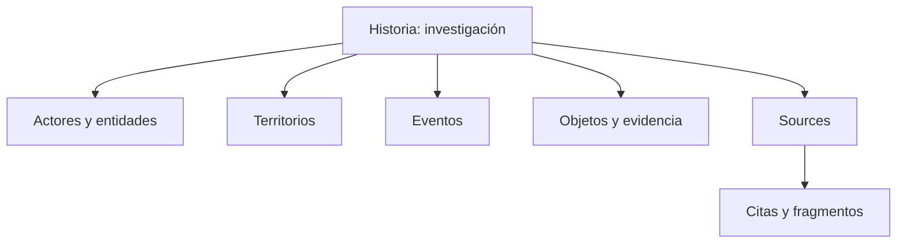

Codex es el espacio de conocimiento de Pulse Journal. Sirve para guardar lo que sabes, de dónde salió y cómo se relaciona con una investigación.

## Qué puedes registrar

| Concepto | Úsalo para |
| --- | --- |
| Persona | Diputados, periodistas, empresarios, testigos o cualquier individuo real |
| Entidad | Instituciones, empresas, partidos, organizaciones y colectivos |
| Territorio | Países, municipios, áreas investigadas y puntos del mapa |
| Evento | Audiencias, elecciones, contratos, protestas, reuniones o publicaciones relevantes |
| Historia | Una investigación, caso legal, narrativa o marco de análisis |
| Objeto | Expedientes, documentos, evidencia, datasets y archivos |
| Artefacto | Sistemas, herramientas, infraestructura, métodos y protocolos |
| Fuente | Enlaces, libros, entrevistas, archivos o personas consultadas |

Una Fuente aparece como `Source` en el contrato técnico. Tiene una ficha propia para autoría, cita, procedencia, verificación y confidencialidad.

## Persona y Perfil no son lo mismo

Una **Persona** corresponde a un individuo real.

Un **Perfil** representa un tipo de persona o grupo para explorar comportamientos, necesidades y posibles reacciones. Por ejemplo: “Jóvenes que frecuentan Zona 1”. No corresponde a una persona real.

## Post y Snippet

Los Posts y Snippets ayudan a capturar contenido:

- un **Post** conserva una publicación de una plataforma;
- un **Snippet** guarda una nota, cita o fragmento.

Son auxiliares. Puedes relacionarlos con una investigación, pero no forman parte de los ocho tipos oficiales de ítem.

## Cómo se conecta una investigación

Una Historia puede funcionar como centro. Relaciona allí las personas, organizaciones, lugares, hechos, evidencia y Sources que explican el caso.

<CardGroup cols={2}>
  <Card title="Configurar una ficha" icon="sliders" href="/codex/guia/campos-y-presets">
    Usa presets y agrega campos sin duplicarlos.
  </Card>
  <Card title="Ver casos de uso" icon="magnifying-glass" href="/codex/guia/casos-de-uso">
    Sigue ejemplos periodísticos, legales y territoriales.
  </Card>
</CardGroup>
