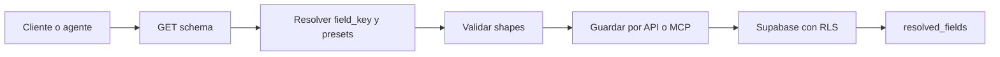

Codex v4.1 separa identidad, presentación y valor:

- `field_key`: identidad estable de un campo.
- `label`: texto visible que puede cambiar por idioma o copy.
- `value`: dato validado según `field_type`.

También separa entidades del universo, contenido auxiliar y recursos operativos.

| Clase | Valores | Persistencia |
| --- | --- | --- |
| Ítem oficial | Actor, Entidad, Territorio, Evento, Historia, Objeto, Artefacto, Source | `codex_universe_items` |
| Auxiliar | Post, Snippet | Conserva `tipo`, pero no se presenta como ítem oficial |
| Recurso | Simulacion | Tablas operativas de simulaciones y eventos |

`Perfil` no es un tipo. Es un `Actor` con `is_profile = true`.

## Componentes

| Componente | Responsabilidad |
| --- | --- |
| `codexSchema.js` | Tipos, campos del sistema, aliases, presets y presentación |
| `codexContractV4.js` | Resolución, creación, validación y lectura resuelta |
| Rutas Codex | API REST para schema, campos, Sources, Perfiles y Simulaciones |
| Servicio MCP | Herramientas agentic y adaptación al contrato v4.1 |
| `codex_universe_items` | Ítems oficiales y auxiliares aislados por usuario |
| `codex_user_fields` | Catálogo de campos personales |
| `codex_user_presets` | Presets personales |
| Tablas de simulación | Estado reproducible y timeline append-only |

`codex_items` continúa como biblioteca de archivos, monitoreos y contenido capturado. No sustituye `codex_universe_items`.

## Flujo de escritura

1. El cliente solicita el schema autenticado.
2. Combina los campos base, los presets aplicados y los campos ya asociados.
3. Resuelve cualquier campo nuevo contra el catálogo del usuario.
4. Valida cada valor según su `field_type`.
5. El backend verifica referencias y ownership.
6. La lectura devuelve `resolved_fields` con definición, valor y estado.

## Convenciones de clave

| Origen | Convención | Ejemplo |
| --- | --- | --- |
| Campo del sistema | `sys_<tipo>_<slug>` | `sys_actor_cargo` |
| Campo personal | `usr_<slug>` | `usr_oficina` |
| Preset base | `sys_base_<tipo>` | `sys_base_source` |
| Preset personal | `usr_preset_<slug>` | `usr_preset_politica` |

Los campos del sistema viven en ExtractorW. Los campos y presets personales viven en Supabase y pertenecen a un `user_id`.

## Compatibilidad

`details` continúa como puente temporal para clientes anteriores. Los clientes v4.1 deben leer `resolved_fields` y escribir mediante `fields`. No deben usar el label como clave de persistencia.

<Warning>
  El schema desplegado es normativo. Si un tipo, campo o preset no aparece en `GET /api/codex/schema`, el cliente no debe inventarlo ni asumir que ya está disponible.
</Warning>
