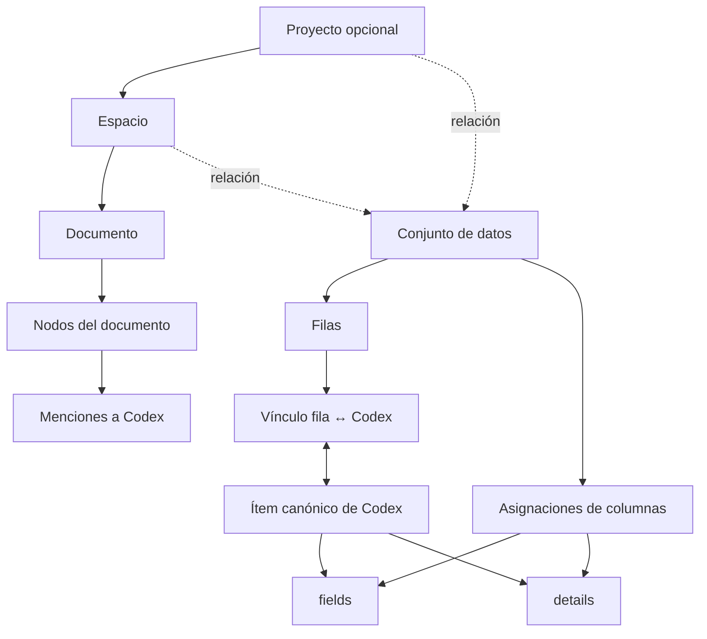
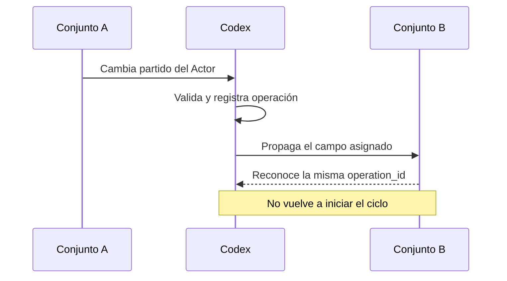

<Warning>
  Esta ficha describe el contrato aprobado para la siguiente evolución de Pulse Journal. Todavía no representa una implementación completa. Las variables de Proyecto, la colaboración activa y las presentaciones quedan fuera de esta fase.
</Warning>

## Estado y alcance

| Propiedad | Valor |
| --- | --- |
| Estado | Propuesto y aprobado a nivel de producto |
| Fecha de decisión | 30 de agosto de 2026 |
| Alcance | Proyectos, Espacios, documentos, conjuntos de datos y su relación con Codex |
| Sincronización | Bidireccional entre una fila vinculada y su ítem de Codex |
| Unidad de propiedad | Usuario |
| Variables de Proyecto | Siguiente fase |

El propósito del contrato es permitir que una persona trabaje con documentos narrativos y datos tabulares sin crear copias contradictorias del mismo Actor, Territorio, Evento u otro ítem de Codex.

## Decisiones normativas

1. Un **Proyecto** puede contener varios Espacios.
2. Un **Espacio** puede pertenecer, por ahora, a un solo Proyecto o existir sin Proyecto.
3. Un conjunto de datos puede existir por sí mismo y relacionarse con Proyectos o Espacios.
4. Una fila declarada como `Actor` puede vincularse con un Actor de Codex, pero esa declaración no copia automáticamente todas sus columnas.
5. Cada columna permanece local al conjunto de datos hasta que el usuario aprueba una asignación.
6. Una columna aprobada puede apuntar a un campo del catálogo o a una clave dentro de `details`.
7. Una clave de `details` no necesita existir previamente en el catálogo si el usuario decide guardarla allí.
8. Después de aprobar el vínculo y las asignaciones, los cambios se propagan en ambos sentidos.
9. Toda operación de alineación inicial debe mostrar una vista previa antes de crear, vincular o actualizar ítems.
10. El agente puede sugerir coincidencias y asignaciones, pero no debe aprobarlas en nombre del usuario.
11. Las variables de Proyecto no forman parte de este contrato.

## Modelo conceptual



El ítem de Codex es la identidad reutilizable. La fila conserva la representación tabular. El vínculo entre ambos indica que representan el mismo objeto lógico y define qué datos se sincronizan.

## Estado actual verificado

La implementación actual ya contiene piezas útiles, pero no constituye todavía el contrato descrito en esta página.

### Conjuntos de datos actuales

Existen dos tablas separadas: `private_datasets` y `public_datasets`. Ambas incluyen campos de conexión con Codex:

| Campo actual | Uso actual |
| --- | --- |
| `codex_connection_mode` | Modo `none`, `track` o `sync` |
| `codex_item_type` | Tipo de ítem que representa una fila |
| `codex_match_column` | Columna utilizada para buscar coincidencias |
| `codex_match_type` | Estrategia de coincidencia |
| `column_mappings` | Asignaciones guardadas en JSON |
| `last_codex_sync` | Última sincronización registrada |

El frontend actual busca coincidencias por nombre, alias o valores guardados en `details`. También utiliza etiquetas derivadas del nombre del conjunto de datos. Ese mecanismo puede ayudar como compatibilidad transitoria, pero no debe convertirse en la identidad permanente del vínculo.

### Espacios actuales

`free_canvases` ya representa la base de un Espacio y contiene `project_id` nullable. La relación actual con Proyecto utiliza `ON DELETE SET NULL`, por lo que eliminar un Proyecto no elimina automáticamente el Espacio.

### Limitaciones actuales

- La identidad del vínculo puede quedar escondida en `details` o en una etiqueta textual.
- Renombrar un conjunto de datos podría romper asociaciones basadas en su nombre.
- Las tablas pública y privada duplican estructura y lógica.
- El contenido de un conjunto de datos se reescribe como un arreglo JSON completo.
- No existe una identidad explícita por fila que pueda vincularse con Codex.
- Un solo `project_id` dentro de un ítem de Codex no representa relaciones de muchos a muchos.
- El contenido estructurado de un Espacio permanece embebido dentro de `free_canvases.data`.
- El mapa de tipos actual no coincide completamente con el contrato Codex v4.1.

## Entidades propuestas

Los nombres siguientes describen responsabilidades. La migración puede conservar nombres físicos existentes mientras se introduce el contrato de forma incremental.

### `datasets`

Entidad canónica para conjuntos de datos públicos y privados.

| Campo | Tipo sugerido | Regla |
| --- | --- | --- |
| `id` | UUID | Identidad estable |
| `user_id` | UUID | Propietario |
| `name` | text | Nombre visible |
| `description` | text nullable | Propósito del conjunto |
| `visibility` | enum | `private` o `public` |
| `schema_definition` | jsonb | Definición de columnas |
| `row_codex_type` | text nullable | Tipo de Codex que puede representar cada fila |
| `connection_mode` | enum | `none`, `track` o `sync` |
| `match_config` | jsonb nullable | Reglas aprobadas para encontrar coincidencias |
| `created_at` | timestamptz | Auditoría |
| `updated_at` | timestamptz | Auditoría |

`visibility` reemplaza la duplicación conceptual entre conjuntos públicos y privados. La unificación física puede realizarse mediante una migración gradual y vistas de compatibilidad.

### `dataset_rows`

Cada fila necesita identidad propia para permitir actualizaciones parciales, referencias y sincronización segura.

| Campo | Tipo sugerido | Regla |
| --- | --- | --- |
| `id` | UUID | Identidad de la fila |
| `dataset_id` | UUID | Conjunto padre |
| `position` | integer | Orden visible |
| `values` | jsonb | Valores locales por clave de columna |
| `created_at` | timestamptz | Auditoría |
| `updated_at` | timestamptz | Auditoría |
| `deleted_at` | timestamptz nullable | Borrado lógico cuando corresponda |

Una fila no es un ítem de Codex por el solo hecho de estar dentro de un conjunto cuyo `row_codex_type` sea `Actor`. Esa configuración únicamente habilita el proceso de alineación.

### `dataset_row_codex_links`

Tabla explícita que registra cuándo una fila y un ítem representan la misma entidad.

| Campo | Tipo sugerido | Regla |
| --- | --- | --- |
| `id` | UUID | Identidad del vínculo |
| `user_id` | UUID | Propietario del vínculo |
| `dataset_row_id` | UUID | Fila vinculada |
| `codex_item_id` | UUID | Ítem canónico |
| `status` | enum | `pending`, `confirmed`, `rejected` o `detached` |
| `match_method` | enum | `manual`, `exact`, `alias` o `agent_suggested` |
| `match_score` | numeric nullable | Evidencia para la vista previa |
| `confirmed_by` | UUID nullable | Usuario que aprobó |
| `confirmed_at` | timestamptz nullable | Fecha de aprobación |
| `created_at` | timestamptz | Auditoría |

Restricciones sugeridas:

- una fila solo puede tener un vínculo activo hacia Codex;
- un mismo ítem de Codex puede aparecer en varios conjuntos de datos;
- fila e ítem deben pertenecer al mismo usuario o ser accesibles según una política pública explícita;
- el backend debe validar el tipo declarado por el conjunto contra el tipo real del ítem.

## Asignaciones de columnas

### Distinción entre vínculo y asignación

El vínculo responde: **¿qué ítem representa esta fila?**

La asignación responde: **¿qué significa esta columna dentro de la ficha?**

Son decisiones diferentes. Vincular una fila con un Actor no autoriza copiar todas sus columnas.

### `dataset_field_bindings`

| Campo | Tipo sugerido | Regla |
| --- | --- | --- |
| `id` | UUID | Identidad |
| `dataset_id` | UUID | Conjunto al que aplica |
| `column_key` | text | Clave estable de la columna |
| `target_kind` | enum | `field` o `details` |
| `target_key` | text | `field_key` o clave de `details` |
| `direction` | enum | `both`, `dataset_to_codex` o `codex_to_dataset` |
| `empty_policy` | enum | Tratamiento de valores vacíos |
| `approved_by` | UUID | Usuario que aprobó |
| `approved_at` | timestamptz | Fecha de aprobación |
| `active` | boolean | Habilita la sincronización |

Ejemplo con un campo del catálogo:

```json
{
  "column_key": "partido",
  "target_kind": "field",
  "target_key": "sys_actor_partido_politico",
  "direction": "both",
  "empty_policy": "ignore_empty"
}
```

Ejemplo con una clave personalizada en `details`:

```json
{
  "column_key": "bloque_votacion_2026",
  "target_kind": "details",
  "target_key": "bloque_votacion_2026",
  "direction": "both",
  "empty_policy": "ignore_empty"
}
```

<Note>
  Si el usuario elige `details`, el contrato permite guardar la clave aunque no exista en `codex_user_fields`. Si el usuario quiere que el dato aparezca como un campo reutilizable y tipado en la interfaz, debe crear o elegir un campo del catálogo.
</Note>

### Reglas de claves y etiquetas

- `column_key` y `target_key` son identidades estables.
- El nombre visible de una columna o campo puede cambiar sin romper el vínculo.
- La interfaz debe mostrar labels comprensibles, no UUID crudos.
- El agente debe resolver claves existentes antes de sugerir una nueva.
- Dos labels parecidos no implican que dos claves sean equivalentes.

## Vista previa obligatoria

La alineación inicial se divide en dos operaciones: preparar y aplicar.

### Preparar

La preparación no escribe vínculos ni modifica fichas. Devuelve:

- filas analizadas;
- coincidencias exactas;
- coincidencias por alias;
- candidatos sugeridos;
- ítems que tendrían que crearse;
- columnas propuestas para `fields`;
- columnas propuestas para `details`;
- cambios que ocurrirían en cada dirección;
- conflictos y valores vacíos.

Ejemplo conceptual:

```json
{
  "dataset_id": "uuid",
  "row_codex_type": "Actor",
  "summary": {
    "rows": 160,
    "exact_matches": 132,
    "suggested_matches": 18,
    "new_items": 10,
    "conflicts": 4
  },
  "requires_confirmation": true
}
```

### Aplicar

La aplicación recibe únicamente decisiones ya confirmadas. Debe ser idempotente: repetir la misma solicitud no puede crear vínculos, ítems ni eventos duplicados.

## Sincronización bidireccional

Después de confirmar el vínculo y las asignaciones:

- cambiar una celda asignada actualiza el destino correspondiente en Codex;
- cambiar el campo o `details` en Codex actualiza todas las filas vinculadas que tengan la misma asignación activa;
- una columna no asignada permanece local;
- una propiedad de Codex sin asignación permanece fuera del conjunto de datos.

Ejemplo:



### Prevención de ciclos

Cada mutación sincronizada debe transportar:

| Campo | Uso |
| --- | --- |
| `operation_id` | Identidad idempotente de la operación |
| `origin_kind` | `dataset`, `codex`, `mcp`, `api` o `migration` |
| `origin_id` | Fila, ítem o proceso que inició el cambio |
| `occurred_at` | Orden temporal |
| `actor_user_id` | Usuario responsable |

Un consumidor que ya procesó `operation_id` confirma la operación sin emitir otra equivalente.

### `codex_sync_events`

Un registro de eventos permite auditoría, reintentos e investigación de conflictos.

| Campo | Uso |
| --- | --- |
| `operation_id` | Idempotencia |
| `user_id` | Ownership |
| `source_kind` / `source_id` | Origen |
| `target_kind` / `target_id` | Destino |
| `field_key` | Dato afectado |
| `previous_value` / `next_value` | Auditoría |
| `status` | `pending`, `applied`, `skipped`, `conflict` o `failed` |
| `error` | Motivo de fallo |
| `created_at` / `applied_at` | Timeline |

## Valores vacíos y conflictos

El comportamiento debe declararse por asignación.

| Política | Comportamiento |
| --- | --- |
| `ignore_empty` | Un valor vacío no borra el destino |
| `propagate_empty` | El vacío borra el destino |
| `confirm_clear` | El borrado requiere confirmación |

La política inicial recomendada es `ignore_empty`, porque una importación incompleta no debería borrar información ya curada.

Para ediciones individuales sin concurrencia, el último cambio confirmado por el servidor puede convertirse en el valor vigente. Las importaciones masivas deben pasar por vista previa. Si dos operaciones incompatibles compiten sobre el mismo dato, el sistema debe registrar un conflicto y mostrarlo para revisión en vez de resolverlo silenciosamente.

## Borrado y desvinculación

Eliminar una fila, desvincularla y eliminar un ítem son acciones distintas.

- **Eliminar fila:** no elimina automáticamente el ítem de Codex.
- **Desvincular:** conserva ambos registros, detiene la sincronización y marca el vínculo como `detached`.
- **Eliminar ítem de Codex:** requiere revisar vínculos activos y referencias.
- **Eliminar conjunto de datos:** no elimina ítems de Codex creados o vinculados previamente.
- **Eliminar Proyecto:** conserva los Espacios y establece su `project_id` en `null`.

## Proyectos y Espacios

### Proyectos

La entidad de Proyectos existente continúa como nivel organizativo superior. En esta fase solo se utiliza para agrupar Espacios y relacionar recursos.

Un Proyecto no es obligatorio. Su memoria, objetivos, tareas y variables se diseñarán en fases posteriores. Este contrato no define todavía su sistema de variables.

### Espacios

`free_canvases` puede evolucionar de forma compatible hacia el contrato de Espacio.

| Campo | Regla |
| --- | --- |
| `id` | Identidad del Espacio |
| `user_id` | Propietario |
| `project_id` | Nullable; un solo Proyecto por ahora |
| `name` | Nombre visible |
| `space_type` | Novela, demanda, artículo, investigación u otro |
| `settings` | Preferencias de vistas y organización |
| `created_at` / `updated_at` | Auditoría |

El nombre físico puede mantenerse durante la migración, pero las API nuevas deben utilizar el concepto `space`.

### Documentos y nodos

El contenido largo no debería depender indefinidamente de un único JSON en el Espacio.

#### `space_documents`

| Campo | Uso |
| --- | --- |
| `id` | Documento |
| `space_id` | Espacio padre |
| `document_type` | Artículo, demanda, novela, informe u otro |
| `title` | Nombre visible |
| `position` | Orden |
| `metadata` | Configuración específica |

#### `space_document_nodes`

| Campo | Uso |
| --- | --- |
| `id` | Nodo estable |
| `document_id` | Documento padre |
| `parent_id` | Jerarquía recursiva nullable |
| `node_type` | Capítulo, escena, sección, argumento u otro |
| `title` | Label visible |
| `content` | Contenido del editor |
| `position` | Orden entre hermanos |
| `metadata` | Configuración del nodo |

La jerarquía es estructural; los nombres visibles dependen del tipo de trabajo. El contrato no debe codificar que el nivel uno se llama siempre “capítulo” o que el nivel dos se llama siempre “escena”.

### Menciones a Codex

`space_codex_mentions` debe conservar referencias explícitas desde un fragmento del documento hacia un ítem de Codex.

| Campo | Uso |
| --- | --- |
| `document_node_id` | Nodo donde aparece |
| `codex_item_id` | Ítem mencionado |
| `surface_text` | Texto escrito, por ejemplo “Mark” |
| `range_start` / `range_end` | Ubicación en el contenido |
| `status` | Sugerida, confirmada o rechazada |
| `confirmed_by` | Usuario que resolvió ambigüedad |

La detección automática puede sugerir una mención. Si existen varias coincidencias plausibles, la interfaz debe pedir confirmación.

## Relaciones de recursos

Proyectos, Espacios y conjuntos de datos necesitan relaciones de muchos a muchos sin modificar la identidad del recurso.

Una tabla de asociaciones tipada puede registrar:

| Campo | Uso |
| --- | --- |
| `user_id` | Propietario |
| `container_kind` | `project` o `space` |
| `container_id` | Proyecto o Espacio |
| `resource_kind` | `dataset`, `codex_item`, `folder`, `file` u otro permitido |
| `resource_id` | Recurso relacionado |
| `role` | Evidencia, referencia, biblioteca, datos principales u otro |
| `created_at` | Auditoría |

El backend debe validar cada combinación. Un UUID y un `resource_kind` enviados por el cliente no sustituyen una comprobación de ownership.

## Contrato MCP propuesto

Las herramientas MCP deben utilizar las mismas reglas que la interfaz y la API.

### Operaciones mínimas

| Operación | Resultado |
| --- | --- |
| `dataset.preview_codex_alignment` | Sugiere coincidencias y asignaciones sin escribir |
| `dataset.apply_codex_alignment` | Aplica decisiones confirmadas |
| `dataset.update_row` | Cambia solo una fila y dispara sincronización |
| `dataset.bind_column` | Registra una asignación aprobada |
| `dataset.unbind_column` | Detiene la sincronización de una columna |
| `dataset.detach_row` | Desvincula fila e ítem |
| `space.create` / `space.update` | Gestiona el Espacio |
| `space.document.*` | Gestiona documentos y nodos |
| `space.codex.resolve_mentions` | Sugiere referencias y exige confirmación cuando haya ambigüedad |

### Reglas agentic

- Consultar schema, tipos y claves antes de proponer.
- Mostrar labels al usuario y enviar claves estables al backend.
- No crear asignaciones de `details` sin aprobación inicial.
- No crear ítems durante una vista previa.
- No elegir silenciosamente entre candidatos ambiguos.
- Incluir `operation_id` en mutaciones reintentables.
- Devolver conteos y conflictos después de una sincronización masiva.

## RLS y seguridad

Todas las entidades personales deben verificar `auth.uid() = user_id` directa o indirectamente.

Para conjuntos públicos:

- el propietario o un administrador puede modificar el conjunto original;
- otros usuarios pueden consultarlo según la política publicada;
- sincronizar un conjunto público con un Codex personal requiere una política explícita.

<Warning>
  Falta cerrar una decisión de seguridad: si un lector de un conjunto público puede vincular sus filas directamente con su Codex personal o si primero debe crear una copia privada. Hasta resolverla, el contrato no debe permitir escrituras cruzadas desde un conjunto público ajeno.
</Warning>

El servicio debe validar referencias en el servidor. La existencia del UUID no demuestra acceso ni compatibilidad de tipo.

## Migración incremental

### Fase 1: contrato y compatibilidad

- Publicar tipos y endpoints nuevos sin retirar los actuales.
- Introducir IDs estables para filas.
- Definir adaptadores para `private_datasets` y `public_datasets`.
- Alinear el mapa de tipos con Codex v4.1.

### Fase 2: vínculos explícitos

- Crear `dataset_row_codex_links`.
- Importar asociaciones confiables desde metadatos actuales.
- Enviar coincidencias ambiguas a revisión.
- Dejar de usar el nombre del conjunto como identidad.

### Fase 3: asignaciones y sincronización

- Crear `dataset_field_bindings`.
- Implementar vista previa y aplicación idempotente.
- Registrar `codex_sync_events`.
- Activar sincronización bidireccional por asignación.

### Fase 4: modelo canónico de conjuntos

- Unificar visibilidad en una entidad canónica.
- Migrar datos con conteos y verificaciones por usuario.
- Mantener vistas o rutas de compatibilidad durante la transición.
- Retirar la escritura de arreglos JSON completos cuando todos los clientes trabajen por fila.

### Fase 5: Espacios estructurados

- Formalizar `space_documents` y `space_document_nodes`.
- Migrar gradualmente el contenido de `free_canvases.data`.
- Incorporar menciones confirmables hacia Codex.
- Añadir relaciones de recursos con Proyectos y Espacios.

## Criterios de aceptación

- [ ] Una fila vinculada tiene identidad estable independiente de su posición.
- [ ] El vínculo fila–Codex no depende de nombres, tags ni valores dentro de `details`.
- [ ] La vista previa no produce escrituras.
- [ ] Un usuario confirma coincidencias y asignaciones antes de la primera sincronización.
- [ ] Las columnas no asignadas permanecen locales.
- [ ] Una asignación puede apuntar a un campo del catálogo o a `details`.
- [ ] Un cambio confirmado puede propagarse Dataset → Codex y Codex → Dataset.
- [ ] La misma operación no genera ciclos ni duplicados.
- [ ] Los vacíos no borran información salvo que la política lo permita.
- [ ] Toda referencia valida ownership y compatibilidad de tipo.
- [ ] Un Espacio puede existir sin Proyecto.
- [ ] Un Espacio pertenece como máximo a un Proyecto en esta fase.
- [ ] Eliminar un Proyecto no elimina sus Espacios.
- [ ] Las variables de Proyecto no están incluidas ni se infieren en esta fase.

## Decisiones pendientes

Estas decisiones requieren una fase de diseño propia:

- variables, memoria, objetivos y tareas de Proyecto;
- colaboración activa y permisos entre varios usuarios;
- política final para enlazar conjuntos públicos con un Codex personal;
- límites de tamaño, paginación y procesamiento masivo;
- experiencia de presentaciones y diapositivas;
- política de resolución manual para conflictos simultáneos complejos.

<CardGroup cols={2}>
  <Card title="Modelo de datos vigente" icon="database" href="/codex/tecnica/modelo-de-datos">
    Consulta el contrato Codex v4.1 que ya guía ítems, campos, presets y simulaciones.
  </Card>

  <Card title="Conceptos para usuarios" icon="layers" href="/codex/guia/proyectos-espacios-y-datos">
    Lee cómo se explican Proyectos, Espacios y conjuntos de datos dentro de la app.
  </Card>
</CardGroup>
